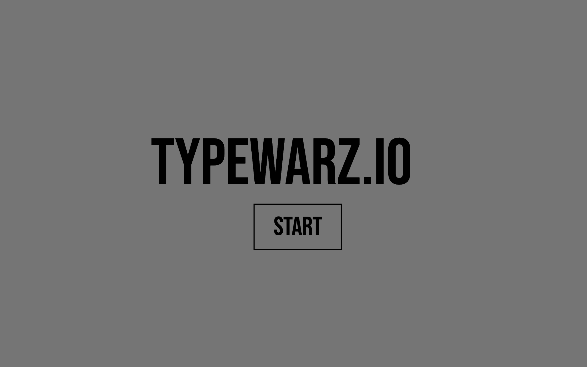
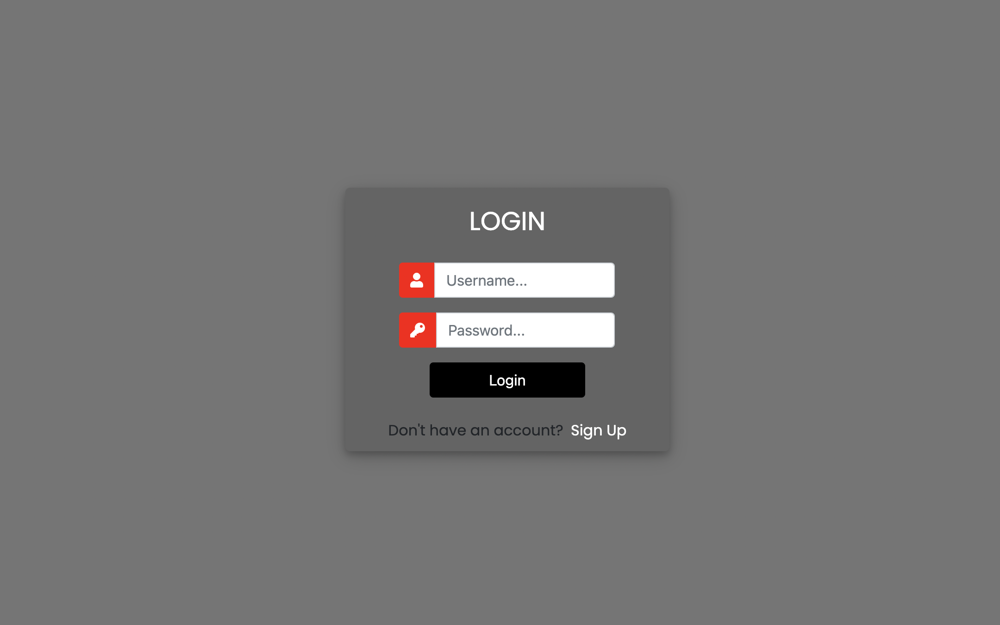
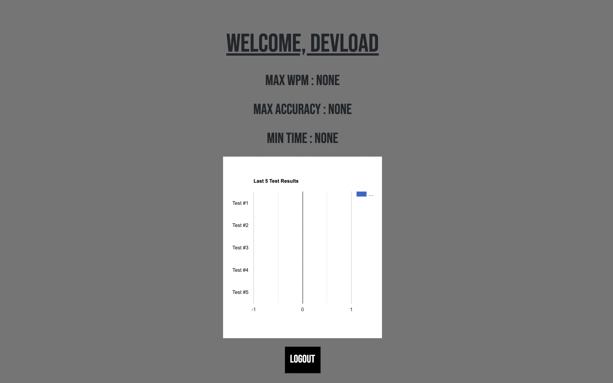

# Typewarz.io

A minimalistic typing test website using Django and Vanilla JS that tracks user keystrokes to provide accuracy and WPM measurements. Built a User database that provides previous test data and allows for users to make their own accounts.

### Made using:
* HTML
* CSS
* JavaScript
* Python
* Django

### A personalized account:

An account that stores a user's max word per minute, max accuracy, min time and the last 5 test results.

