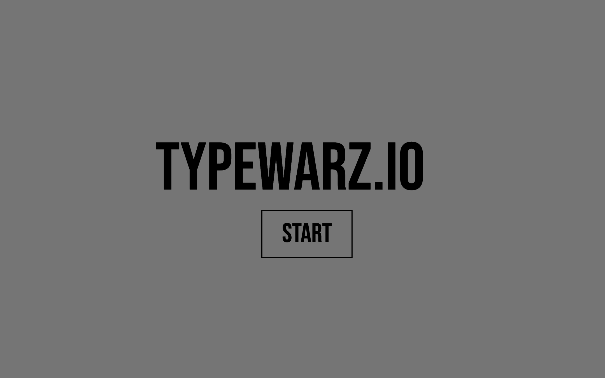
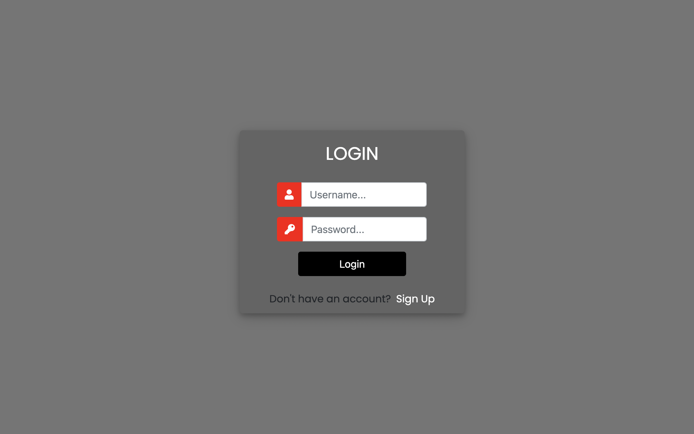
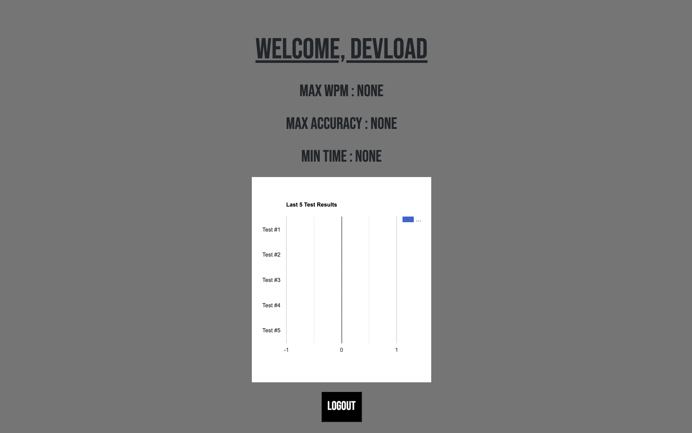
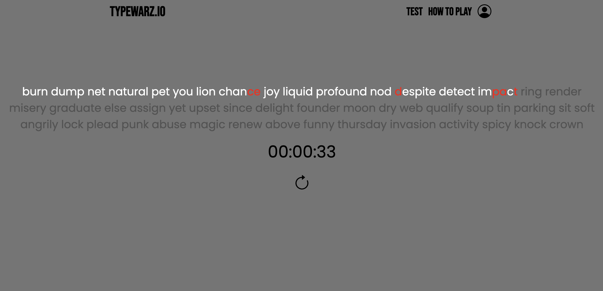
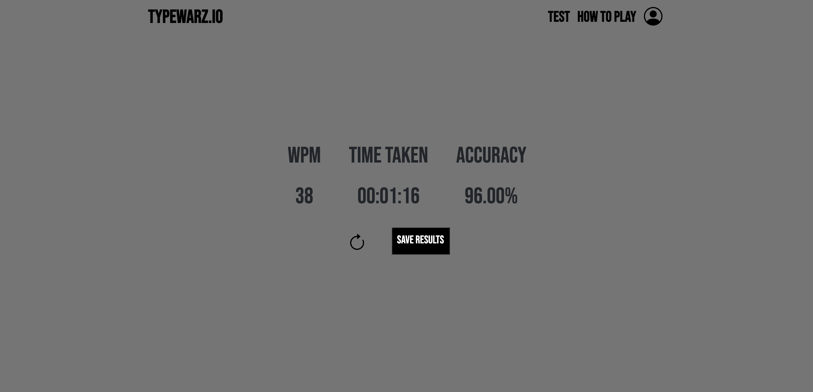

# Typewarz.io

A minimalistic typing test website using Django and Vanilla JS that tracks user keystrokes to provide accuracy and WPM measurements. Built a User database that provides previous test data and allows for users to make their own accounts.

## The Goal?
Type all the words in the shortest time possible!

## Made using:
* HTML
* CSS
* JavaScript
* Python
* Django

## A personalized account:

An account that stores a user's max word per minute, max accuracy, min time and the last 5 test results.

## The test page

50 words that are generated randomly and a timer is displayed. The timer begins with the first key stroke. 

The color scheme:
* gray - to be typed
* white - correct
* red - incorrect

## The results page 

The results page displays the user's words per minute, their total time and accuracy as a percentage.

Users have the option to redo the test and save their results.

## How are the words generated?
50 words are generated from a list of words.

## How are the keystrokes tracked
A variable is used to store and mimic the user's keystrokes. Every keydown event is recorded and then compared to the expected event which is then used to check for correctness and accordingly colored.

The timer begins with the first keystroke. As the seconds pass, the minutes and hours are calculated and displayed.

## How are the results calculated?
The accuracy is calculated by dividing the correct typed by the total words.
The WPM is calculated using the formula: ((100 * accuracy)/total time (in seconds)) * 60.

## What is Django?
It is a web framework that allows devlopers create dynamic websites and provides features like security. [Read more]("https://www.djangoproject.com/start/overview/")
